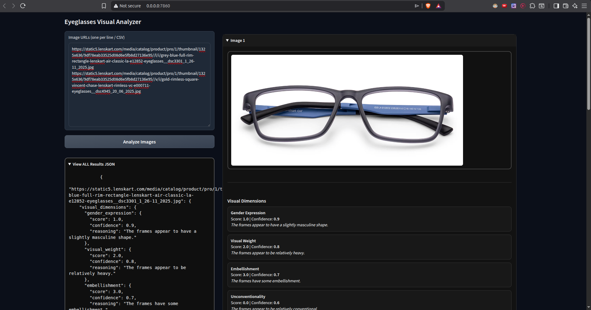

# AI-Powered Visual Product Measurement System

Lenskart Campus Assignment A1.0

This repo contains a system to analyze eyeglasses images and extract objective, visible product characteristics using AI vision models. 
Outputs structured, machine-readable data without applying merchandising or user preference logic.

- (i used gemma3:4b, ministral-3:3b, qwen3-vl:4b)
small models since i didnt have GPU (on home server)
---

`backend logic in: backend/api`

## TODO: 
- Analyze eyeglasses product images
- Extract only observable visual properties
- Return consistent, structured outputs
- Avoid subjective styling or recommendation logic (no extra information / comments from LLM)

---

## Architecture

Microservices setup using Docker.

I used 4 services to build this system

### Services
- LLM Service: Ollama running vision capable models like `gemma3:4b, ministral-3:3b, qwen3-vl:4b`
- Backend API: FastAPI for image analysis and exception handeling 
- Supabase: sql based databse which stores the hash values of images (unique) and returns the cache results 
- Frontend UI: Gradio web interface

### Data Flow
- User submits image URLs via UI (multiple at once or one at a time)
- Backend checks if image is already presend in the database (i.e. already processed)
- Backend fetches images from the URL
- Images sent to LLM for analysis
- LLM returns structured JSON
- Results displayed and exportable

---

## Setup & Installation

### 1) Manual Setup (recommended if GPU drivers are already configured on local device)
- Install [Ollama](https://ollama.com/download)
- Pull `gemma3:4b`
- Install Python libraries (requirements.txt)
- Run FastAPI + Gradio separately, AND ENSURE the the ollama client is running in background OR execute `ollama serve` to start it (ollama services are available at port 11434)
      - check http://localhost:11434/ (should return `Ollama is running`)

- Clone repo
- cd into the repo
- Setup the env variables (provided at the bottom (check my server, run `cat .env`))

### 2) using docker (not recommended because of no GPU support)
- Docker + Docker Compose (If not installed pls refer to the bottom of this documentation) 
- ~8GB RAM (i would reccomend GPU, but its wayy too expensive on cloud platforms)
- update the .env from my machine 
  `easier, but slow (i was unable to configure the GPU drivers in the docker container, so the LLM server dos'nt detect GPU))`

### Quick Start 
- Setup the env variables (provided at the bottom (check my server, run `cat .env`))
- Run `docker-compose up` (watch the logs)
  `It will take a while to download all the models, file: /Lenskart/backend/llm_server/Dockerfile, i have written gemma3:4b ONLY, since it takes very long time to download these models`

Services started:
  - Backend: `localhost:8000`
  - UI: `localhost:7860`

## GO TO localhost:7860 to interact with the UI

---

## Ports & Services
- FastAPI backend: `8000`
- Gradio UI: `7860`
- Ollama service: default Ollama port (11434)
- Config via environment variables / Docker
- supabase DB: https://lnchdddfspjufmpbxoui.supabase.co

---

## Visual Measurement Dimensions 
# The results might be off because im using a small model (~4B parameters)
(as mentioned in the assignment)
Each attribute is scored from `-5.0` to `+5.0` with a corresponding confidence score.

- Gender Expression (masculine ↔ feminine)
- Visual Weight (sleek ↔ bold)
- Embellishment (simple ↔ ornate)
- Unconventionality (classic ↔ avant-garde)
- Formality (casual ↔ formal)

---

## Visual Attributes
- Wireframe presence
- Frame geometry
- Transparency
- Dominant colors
- Surface texture
- Kids suitability

---

## Visual Metadata
- Image clarity
- View angle
- Lighting conditions
- Ambiguities (if any)

---

## API Usage

### Endpoint
- `GET /analyze/{image_url}`

  example: `http://localhost:8000/analyze/https://static5.lenskart.com/media/catalog/product/pro/1/thumbnail/1325x636/9df78eab33525d08d6e5fb8d27136e95//l/i/grey-silver-full-rim-rectangle-lenskart-air-formals-la-e16643-eyeglasses__dsc7672_24_09_2025.jpg`

### Output
- Structured JSON
- In the json, Scores + confidence + reasoning
- Validated via Pydantic schemas

---

## User Interface

Gradio UI supports:
- Single & bulk image URLs
- Visual result rendering
- JSON export
- Error feedback for invalid inputs

---

## Code Structure
- `image.py`  
  - Image fetching
  - Ollama interaction
  - Prompt handling
  - Output parsing

- `schema.py`  
  - Pydantic data models
  - 
- `main.py`  
  - FastAPI endpoints
  - Async processing
  - Basic Error handling

- `gradio_app.py`  
  - UI logic
---

## AI Integration
- Model: Gemma3:4b via Ollama
- Deterministic output (temperature = 0)
- Structured prompts
- JSON schema enforcement

---

## Key Decisions
- Microservices for separation of concerns
- Docker for reproducibility
- Ollama for self-hosted inference
- FastAPI for async performance
- URL-based image input

---

## Limitations
- VERY High Resource usage (RAM && GPU)
- Single vision model
- Slow
  [Attatch ollama logs here] 
- Internet required for image fetch

---

## Future Improvements
- Multi-model support
- Batch optimization
- rate limiting

---

## Performance Notes
- Latency: ~10–30s per image (if model is already loaded in GPU memory, it takes ~12 secs to process an image, if its CPU, we have to wait for ~120 seconds)
- Throughput limited by model (really cant do anything about this other than improving the inftastructure)
- Memory-heavy inference 

---

## Development Notes
- Focused on prompt consistency
- Heavy emphasis on schema design
- Handling AI unpredictability
- Translating raw AI output into usable data

---

# Test on my machine
## DEMO 
[demo video in public dir: public/demo,mp4]

I have deployed this on my Home Server, available at: `https://lenskart.devvdeploy.site/`
You can access this server via ssh (ssh.devvdeploy.site) OR at `cockpit.devvdeploy.site` 
- Username: `lenskart`
- password: `lenskart`

(pls do not misuse my machine or sniff my network 😭🙏🙏, this user will be removed after 10 days)
